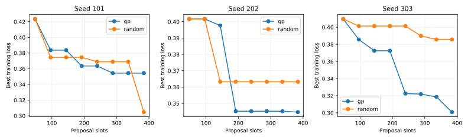
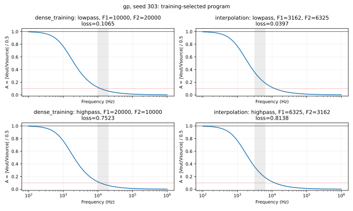

# Evolved Circuit Construction

**Conditional, parameterized analog-circuit construction with genetic programming**

**M1 complete:** executable reconstruction, 24 passing correctness tests, and six
completed pilot searches. GP had worse mean held-out loss than random search at
the declared budget. No assessed champion met the engineering success criterion.
See the [full M1 report](reports/m1.md) and [machine-readable comparison](artifacts/m1/comparison.json).

## Abstract

We study programs that develop passive circuits from frequency requirements,
reconstructing developmental genetic-programming mechanisms from Koza and
colleagues [1,2]. Typed trees can change topology, execute one conditional branch,
and compute component values from inputs. In a three-seed pilot, full GP and
independent random search each used 384 proposals per seed and the same initial
prior. All 2,304 proposal slots completed in 20.0 seconds with 37.3 MiB peak worker
RSS. Mean held-out interpolation loss was 0.39265 for GP and 0.34174 for random
search; the paired difference was +0.05090, where negative would favor GP. No
champion succeeded on any of 132 assessed requirements. The implementation and
pilot are working, but this small experiment does not demonstrate a generalization
advantage or successful parameterized filter synthesis.

## 1. Introduction

The research object is a **circuit-construction program**. A single genotype takes
passband and stopband boundaries and develops a circuit for each requirement.
Evolution can change component types, connections, numerical expressions, and
conditional instructions. Our question is whether fitness-guided variation
discovers useful construction procedures that generalize to unseen requirements.

For inputs `(F1,F2)`, F1 < F2 requests a lowpass response; F2 < F1 requests a
highpass response. A program must learn how its inputs affect construction. The
software supplies elementary circuit operators and physical evaluation; it does
not supply a finished filter template or a hand-written mode switch. Ordinary GP
generates and varies candidates, with no model calls inside the experiment.

## 2. Related Work

Koza, Yu, Keane, and Mydlowec describe conditional developmental programs with
free variables for generalized circuit construction [1]. Their developmental
conditional executes only its selected branch. The broader synthesis treatment
describes evolving circuit topology and sizing from an embryo inside a fixed
electrical fixture [2]. These are the mechanisms reconstructed here; historical
numerical settings and reported results are not measurements of this project.

DEAP provides typed-GP generation and variation [3]. We interpret its trees lazily
to control circuit side effects. The local nodal solver is checked against
closed-form loaded circuits. ngspice is a possible independent reference [4],
but it was absent on this machine and no ngspice validation is claimed.

## 3. Method

The implemented pipeline is:

`typed program + requirements → lazy development → L/C graph → AC response → training loss → selection and variation`

An `Embryo(A,B)` tree develops two serial modifiable wire segments between a fixed
1 V source with 1 kΩ source resistance and a fixed 1 kΩ load/probe. The grammar
offers L/C creation, series and parallel division, grounded branches, wire/open
termination, and a lazy conditional. Numerical terminals provide
`log10(F1/1000)` and `log10(F2/1000)`, perturbable constants, and signed protected
arithmetic. Predicate and sizing expressions have separate types. Component
values are bounded to [1e-8,10] H and [1e-12,1e-4] F through an evolved expression
and a fixed log-value transform. There are no seeded filter solutions.

The AC solver merges ideal-wire nodes and stamps capacitor admittance jωC and
inductor admittance 1/(jωL), including source and load. It rejects floating,
singular and nonfinite circuits without adding artificial conductance. Amplitude
is `A = abs(Vout/Vsource)/0.5`, using the fixed through-connection gain. Per-case
loss is half the mean squared passband error from 1 plus half the mean squared
stopband amplitude. Transition frequencies are unscored. Equal training losses
are broken by fewer active components, then fewer genotype nodes.

GP uses tournament selection, compatible crossover, subtree/constant mutation,
and two parent elites. Every child, copy, duplicate and invalid proposal consumes
a budget slot. Cached scores save simulation time without increasing the proposal
budget. Random search samples the same initialization grammar independently.
Assessment runs only after the training-selected champion is fixed.

The restricted grammar, prior, value transform and numerical constants are our
reconstruction choices. [Mechanism documentation](docs/MECHANISM.md) specifies the
operators, implementation decisions and source correspondence. The
[frozen configuration](configs/m1.json) exposes the fixture, scoring, splits and
budgets. It enforces one worker, one BLAS thread, at most 12 created components,
24 allocated circuit nodes, 127 GP nodes, and depth 9. The worker has a 768 MiB
address-space cap applied before NumPy imports; the batch has a cumulative
20-minute deadline and a 100 MiB output ceiling.

## 4. Experimental Design

| Hypothesis | Controlled comparison | Status |
|---|---|---|
| H1: Fitness-guided evolution improves search | Full GP versus random search; held-out loss at equal proposals | M1 pilot executed |
| H2: Conditional construction helps | Full GP versus GP without developmental conditionals | Not run |
| H3: Input-dependent sizing helps generalization | Full GP versus constants-only sizing, retaining predicate inputs | Not run |
| H4: Crossover helps search | Full GP versus mutation-only GP | Not run |

M1 used seeds 101, 202, 303, population 48, and 384 proposals per method/seed,
including the initial 48. Methods shared the same initial population within each
seed. A separate fixed RNG randomized within-pair execution order; it happened
to place GP first in all three pairs. The six training cases use b = 1, 10, 100 kHz
and both `(b,2b)` and `(2b,b)`. Training uses 81 log-spaced frequencies from 100 Hz
to 1 MHz plus exact requirement boundaries.

The frozen assessment consists of 12 interpolation requirements, four diagnostic
extrapolation requirements, and all six training requirements reevaluated on a
dense grid of 401 frequencies plus boundaries. The success criterion requires
passband amplitude within 0.10 of 1 and stopband amplitude at most 0.10 at every
scored frequency. Continuous loss remains the primary outcome. The unit of
replication is the search seed. The [experimental protocol](docs/EXPERIMENT.md)
contains the exact splits and the later study proposal; M1 did not start that study.

## 5. Results

All six searches and post-search assessments completed. The following values are
from the saved training-selected champions; smaller loss is better.

| Seed | GP train | Random train | GP interpolation | Random interpolation | GP − random interpolation |
|---:|---:|---:|---:|---:|---:|
| 101 | 0.354412 | 0.304621 | 0.450302 | 0.272304 | +0.177998 |
| 202 | 0.344680 | 0.363256 | 0.294154 | 0.367435 | −0.073282 |
| 303 | 0.300858 | 0.385706 | 0.433492 | 0.385495 | +0.047997 |
| Mean | 0.333317 | 0.351194 | **0.392649** | **0.341745** | **+0.050905** |

GP won two training comparisons and one interpolation comparison. Mean dense-grid
training losses were 0.332532 for GP and 0.350376 for random search. Mean diagnostic
extrapolation losses were 0.466149 and 0.400733 respectively. **Zero of 132 assessed
requirements met the success criterion**, including zero of 72 interpolation
cases. All assessed champions were valid and no assessment error was clipped.

The batch took 19.995 seconds, including a four-candidate timing sample, imports,
checkpointing and assessment. Peak worker RSS was 38,212 KiB; one OS thread was
observed. Across 2,304 proposals, caching left 1,688 actual candidate fitness
computations and 10,128 training circuit evaluations. There were 41 invalid
training cases: 0.297% of proposal-weighted cases, or 0.405% of actually computed
cases. All were floating islands. Artifacts occupy 3.60 MiB.



Both methods improved best-so-far training loss in all seeds. The learning curves
show why within-run improvement alone cannot establish that GP beats random search.
The [full report](reports/m1.md) includes all seed-level modes, dense/extrapolation
scores, invalid counts and runtimes. [CSV results](artifacts/m1/seed-results.csv)
and [comparison JSON](artifacts/m1/comparison.json) preserve full precision.

### An observed conditional program

GP/303 produced this nine-node training-selected champion:

```text
Embryo(L(vF1), If(pF2, L(2.9234448256610976), C(vF1)))
```

This example was chosen after inspection to illustrate the mechanism. At
`(F1,F2)=(1000,2000)` the predicate is positive and creates a second inductor;
at `(2000,1000)` it is zero and creates a capacitor. The graphs differ in component
types even when values and node names are ignored. The saved development is:

| Requirement | First segment | Conditional branch | Second segment |
|---|---|---|---|
| Lowpass (1000,2000) | L = 0.000316228 H | then | L = 0.265121425 H |
| Highpass (2000,1000) | L = 0.000632456 H | else | C = 2e-8 F |

The condition tests F2 against 1 kHz, so both orientations choose L at larger
requirements. Its generalization failure is visible in the response plots:



The [lowpass trace and response](artifacts/m1/gp_303/example-1000-lowpass.json),
[highpass trace and response](artifacts/m1/gp_303/example-1000-highpass.json),
[lowpass netlist](artifacts/m1/gp_303/example-1000-lowpass.cir), and
[highpass netlist](artifacts/m1/gp_303/example-1000-highpass.cir) expose the executed
construction. The [report's program index](reports/m1.md#programs-and-observed-development)
links all six champions and response figures. No hand-written fixture is reported
as a discovery.

## 6. Discussion

M1 demonstrates that selection and variation can operate on executable conditional
circuit-construction programs within modest local resources. Correct lazy
execution is also visible in an evolved champion. However, the comparison's mean
held-out effect favors random search, and no program satisfies the fixed
engineering threshold. The three-seed result is descriptive; it is neither a
conclusive test against GP nor support for a general GP advantage.

The small gap between coarse and dense training scores suggests that frequency-grid
resolution alone does not explain the larger requirement-generalization failures
in seeds 101 and 303. Their programs favor lowpass behavior on interpolation, while
some random champions favor highpass behavior. Averaging both modes can reward
partial behavior without discovering a robust conditional procedure. This is an
interpretation of the observed programs and losses, not a new tuned objective.

## 7. Limitations

This is a three-seed pilot at a small proposal budget, with ideal passive components,
a restricted grounded series/parallel grammar, and a sparse training-requirement
grid. The chosen value prior and protected arithmetic affect the search landscape.
The representation omits historical mechanisms such as automatically defined
functions and arbitrary distant-node connections. Analytic solver checks do not
establish real-hardware performance; ngspice agreement was not measured. Success
on the present criterion would still be weaker than the historical engineering
goal. A substantive future method change informed by these holdouts must treat
them as developmental evidence and freeze a fresh confirmatory assessment set.

## 8. Reproducibility

The following setup, test, experiment, plotting, summary and demo commands were
actually executed. Python 3.12 must be available; commands run from the repository
root. The local cache/environment directories are ignored by Git.

```bash
mkdir -p .local/uv-cache .local/python .local/tmp
UV_CACHE_DIR="$PWD/.local/uv-cache" UV_PYTHON_INSTALL_DIR="$PWD/.local/python" uv venv --python python3.12 .venv
UV_CACHE_DIR="$PWD/.local/uv-cache" uv pip install --python .venv/bin/python -r requirements.lock -e '.[test]'
OPENBLAS_NUM_THREADS=1 OMP_NUM_THREADS=1 .venv/bin/python -m pytest -q
.venv/bin/python -m evolved_circuits run --config configs/m1.json --output artifacts/m1
.venv/bin/python -m evolved_circuits plot --output artifacts/m1
.venv/bin/python scripts/summarize_m1.py --output artifacts/m1
.venv/bin/python -m evolved_circuits demo --program artifacts/m1/gp_303/program.txt --f1 2000 --f2 1000 > .local/tmp/m1-demo.json
```

The same `run` command resumes compatible partial checkpoints within the remaining
cumulative budget. On this completed batch it preserves the existing artifacts
and starts no worker; this was verified by hashing all 64 then-existing files.
It refuses incompatible source/configuration/dependency versions. No historical
results are silently overwritten. The selected Python/dependency versions and
source/config hash are in the [manifest](artifacts/m1/manifest.json); all installed
third-party versions are pinned in [requirements.lock](requirements.lock).

The focused suite returned **24 passed**. It protects loaded circuit equations,
construction semantics, typing and limits, candidate accounting, checkpoint
continuation and held-out isolation. Those checks establish software behavior,
not successful evolution or filter synthesis.

The outer [launcher](scripts/run_codex.sh) requests `gpt-6-astra` / Ultra using
ChatGPT authentication and handles publication after the agent returns. The
installed client reported version 0.154.0; an authoritative selected model/effort
was not exposed to this task, so no observed-Ultra claim is made. No mode or billing
switch occurred. Publication status belongs to the launcher's commit/push/remote-SHA
verification, not this paper. The [M1 report](reports/m1.md) records these execution
details and the exact installation commands.

## 9. Conclusion

The project now has a tested developmental GP implementation, reproducible bounded
execution, and inspectable measured pilot artifacts. At the declared M1 budget,
GP improved training fitness but had worse mean interpolation loss than random
search, and neither method produced an assessed circuit meeting the engineering
criterion. M1 is complete; the larger ablation study remains unexecuted.

## References

1. Koza, J. R., Yu, J., Keane, M. A., and Mydlowec, W. (2000). *Use of Conditional Developmental Operators and Free Variables in Automatically Synthesizing Generalized Circuits using Genetic Programming.* [Author-hosted paper](https://www.genetic-programming.com/jkpdf/eh2000parameterizedfilter.pdf).
2. Koza, J. R., Bennett III, F. H., Andre, D., and Keane, M. A. *Synthesis of Topology and Sizing of Analog Electrical Circuits by Means of Genetic Programming.* [Author-hosted manuscript](https://www.genetic-programming.com/jkpdf/cmame.pdf).
3. [DEAP: Genetic Programming](https://deap.readthedocs.io/en/master/tutorials/advanced/gp.html) and [evolutionary operators](https://deap.readthedocs.io/en/master/api/tools.html).
4. [ngspice documentation](https://ngspice.sourceforge.io/docs.html).

See [source notes](docs/SOURCES.md), [implementation decisions](docs/MECHANISM.md),
and the [scientific repository convention](SCIENTIFIC_REPOSITORY_STANDARD.md).
No third-party paper or historical implementation is bundled. Licensing has not
yet been selected.
